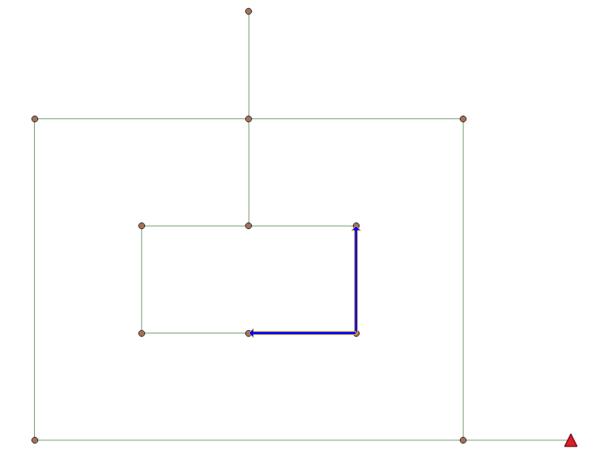

# Case 0

This is a simple case to test the usage of the developed sewer reconstructor.

The sewer network has two simple cycles (where the inner cycle is an island) and is placed on a flat area with an elevation of 0.
The layout of the sewer network can be visualized as follows:



After creating the container `my-sewer-reconstructor` from the image loaded from `thu-sewer-reconstructor.tar`, we can get the sewer model with corresponding `.inp` file by:

```shell {cmd}
docker exec my-sewer-reconstructor \
/root/anaconda3/envs/lyy_sewer/bin/python3 /home/sewer-reconstructor/main.py \
                --slope_config_path /data/case0/slope_config.json \
                --swmm_config_path /data/case0/swmm_config.json \
                --solver_config_path /data/case0/LP_config.json
```

## Invalid setting: fixed outfall elevation

Here we present a failure case of sewer reconstruction due to improper outfall placement.

By changing the `outfall_relaxed` option as `False` (see `LP_fixed_config.json`), we force the outfall elevation to be the originally assigned value, i.e., 0.

When we execute the sewer reconstruction as follows:

```shell {cmd}
docker exec my-sewer-reconstructor \
/root/anaconda3/envs/lyy_sewer/bin/python3 /home/sewer-reconstructor/main.py \
                --slope_config_path /data/case0/slope_config.json \
                --swmm_config_path /data/case0/swmm_fixed_config.json \
                --solver_config_path /data/case0/LP_fixed_config.json
```

We will get the information like `Linear Programming failed !!!` in the logging information, indicating the infeasiblity of the problem where:

- the rim level of nodes (invert elevation + depth) are 0
- the elevation of the outfall is fixed as 0
- the minimum slope is required between the outfall and upstream nodes.

This infeasiblity can automatically derived from irreducible inconsistent subset (IIS) computation offered by solvers such as [Gurobi](https://docs.gurobi.com/projects/optimizer/en/current/features/infeasibility.html#secinfeasibility) and [HiGHS](https://www.gams.com/latest/docs/S_HIGHS.html#HIGHSiis).

Here we use `Gurobi` (with the license obtained for [academic/educational use](https://www.gurobi.com/academia/academic-program-and-licenses/)) as an example:

```python {cmd}
import gurobipy as gp
import os

# ------get IIS------
os.environ["GRB_LICENSE_FILE"] = "gurobi.lic (Gurobi license file)"
m = gp.read("test_depth.lp")   # This LinearProgramming file can be generated if we specify `name` and `save_prefix` in `LP_fixed_config.json`
m.optimize()

m.computeIIS()  # This will compute Irreducible Infeasible Subset
m.write('test_depth.ilp')
```

The generated `test_depth.ilp` gives

```shell {cmd}
\ Model OBJ_copy
\ LP format - for model browsing. Use MPS format to capture full model detail.
\ Signature: 0x3bd25d26f410fc9f
Minimize
 
Subject To
 _C412: var_SW_J137Rec <= -0.7
 _C87: 0.025 var_SW_J137Rec - 0.025 var_OF0Rec >= 0.0015
 _C918: var_OF0Rec = 0
Bounds
 var_SW_J137Rec free
 var_OF0Rec free
End
```

Here we can see the infeasible constraints including `var_SW_J137Rec <= -0.7`, `var_SW_J137Rec - 0.025 var_OF0Rec >= 0.0015`, `var_OF0Rec = 0`
where `OF0` and `SW_J137` are the outfall and the corresponding upstream node, respectively.

This information indicates that we can not achieve the minimum slope betwwen `OF0` and `SW_J137`.

If we further change the `outfall_relaxed` option as `True` (see `LP_config.json`) to allow changes in outfall elevation, the problem should be feasible again.