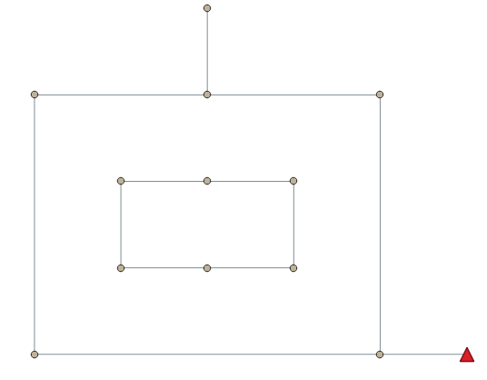

# Case 1

This is a simple case to test the usage of the developed sewer reconstructor.

The sewer network has a similar layout with `case0` but two simple cycles are disconnected.

This can lead to a connectivity error since we can not simultaneously achieve:

- there is no recirculation inside the inner cycle
- all nodes situated the inner cycle (which is not an island) have positive in-degrees. 

This infeasibility can be further generalized to the case that certain nodes in the sewer network are not connected to outfalls.

Thus, it is suggested that we can use `connected components (CC) analysis` (see this [link](https://networkx.org/documentation/stable/reference/algorithms/generated/networkx.algorithms.components.connected_components.html)) to check whether the number of CC is equal to the number of outfalls.
If not, there must be nodes not connected to outfalls and thus we need to add outfalls by GIS analysis.